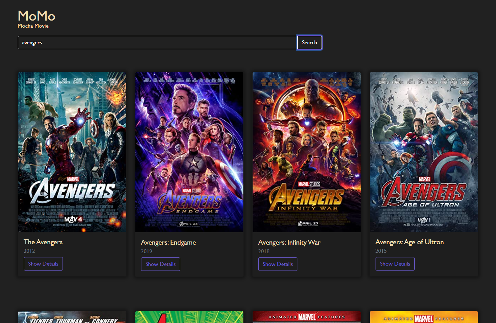

# OMDb Movie API

The OMDb API is a RESTful web service to obtain movie information.

This is made using html, css, and javascript. by using the fetch function where fetch itself is a promise, so with that we can call an API.